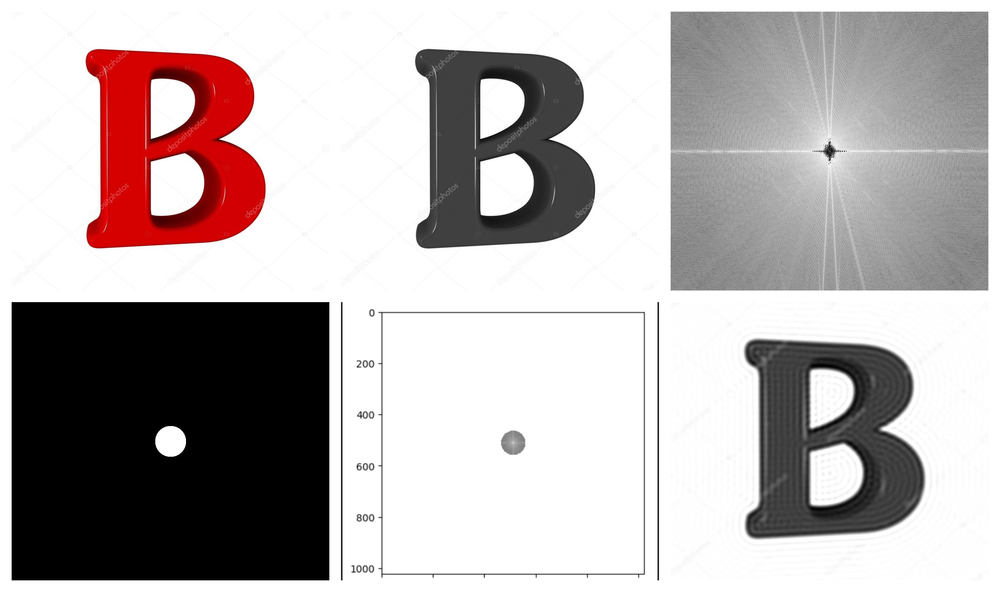

# Fourier-analysis-of-an-image-and-reconstruction-after-filtering
In this simple fun project, we will do Fourier analysis of an image. And then we will reconstruct it after using various kind of filter. We will use some python libraries for Fourier transform. 
We will use Numpy, Open CV, Matplotlib, MATH, Scipy etc libraries.

